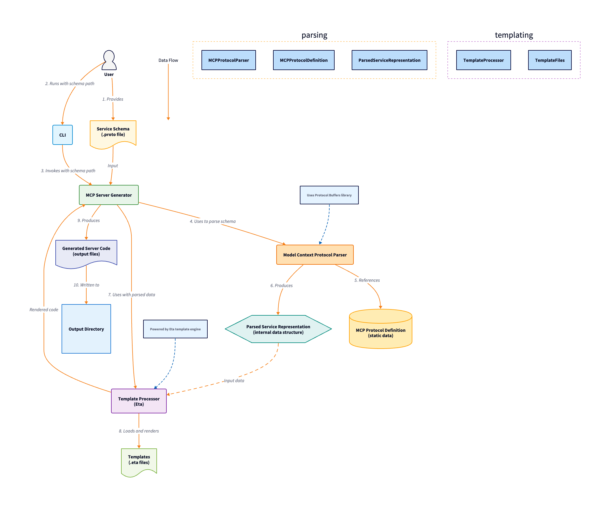
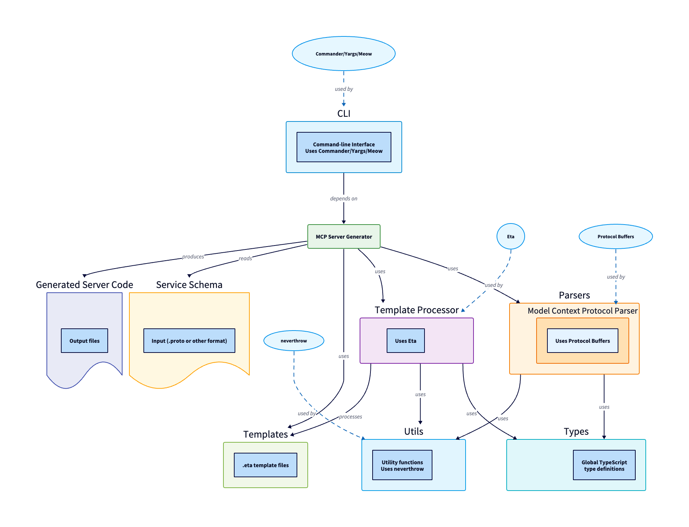

# Axe-Handle Project Structure

This document describes the directory structure and organization of the Axe-Handle project, an MCP server generator.


## Core Purpose for Axe Handle

Axe Handle is a code generation tool designed for developers who want to create Model Context Protocol (MCP) servers rapidly and reliably. It serves developers who want to add MCP interfaces to existing services (like Google Calendar, task managers, or project management tools) or build entirely new MCP-compatible services so that LLM chat agents such as Claude can effectively interact with these services.

By simply defining your service's resources and data structures in a Protobuf schema, Axe Handle generates a complete, production-ready MCP server that wraps your existing APIs. This eliminates the tedious and error-prone process of manually coding MCP interfaces, allowing you to:

1. Quickly enable AI agents to interact with your existing services
2. Maintain consistent implementation of the MCP specification
3. Focus on service-specific logic rather than protocol implementation details

While currently generating TypeScript Express.js servers from Protobuf schemas, Axe Handle's architecture is designed to be adaptable to different input formats and output frameworks as requirements evolve.

## Top-Level Directories

```
axe-handle/
├── docs/
├── src/
│   ├── cli/
│   ├── mcpServerGenerator/
│   ├── parsers/
│   │   └── modelContextProtocol/
│   ├── templateProcessor/
│   ├── types/
│   └── utils/
├── templates/
├── tests/
│   └── fixtures/
└── README.md
```

*   **`docs/`**: Contains high-level documentation for the project, such as design documents, user guides, and API references.
*   **`src/`**: Contains all the source code for the project (written in TypeScript).
*   **`templates/`**: Contains the actual template files used for code generation. These are `.eta` files (see File Extensions below).
*   **`tests/`**: Contains the automated tests for the project.  The structure within `tests/` will mirror the `src/` structure as tests are added.
*    **`tests/fixtures`**: Contains data used for testing, for example example input schemas.
*   **`README.md`**: The main project README file, providing an overview of the project, build instructions, usage examples, etc.

## `src/` Directory Structure

```
src/
├── cli/
│   └── index.ts
├── mcpServerGenerator/
│   ├── handlerGenerator.ts
│   └── serverGenerator.ts
├── parsers/
│   └── modelContextProtocol/
│       ├── index.ts
│       ├── adapter.ts
│       ├── cache.ts
│       ├── protocol.ts
│       └── protocol.json
├── templateProcessor/
│   ├── templateProcessor.ts
│   ├── templateLoader.ts
│   └── templateRenderer.ts
├── types/
│   └── index.ts
└── utils/
    ├── errorUtils.ts
    ├── logger.ts
    └── ...
```




*   **`cli/`**: Contains the code for the command-line interface.
    *   `index.ts`: The entry point for the CLI. This file handles parsing command-line arguments and invoking the appropriate functionality.

*   **`mcpServerGenerator/`**: Contains the code generator for MCP-compliant servers.
    *   `handlerGenerator.ts`: Generates the request handler code.
    *   `serverGenerator.ts`: Generates the main server code (currently using Express).

*   **`parsers/`**: Contains code for parsing input schemas and related data.
    *   `modelContextProtocol/`:  Specifically handles parsing of the Model-Context Protocol (MCP) related inputs.
        *   `index.ts`: Main entry point and exports for the MCP parsing module.
        *   `adapter.ts`: Contains code for adapting the parsed MCP data to a format suitable for code generation.
        *   `cache.ts`: Implements caching for MCP-related data (e.g., the protocol schema).
        *   `protocol.ts`:  TypeScript definitions related to the MCP protocol. This is generated from `protocol.json`.
        *   `protocol.json`:  The MCP protocol schema in JSON format.  This is the *source of truth* for the protocol definition.

*   **`templateProcessor/`**: Contains the template engine logic. This is a general-purpose template processor, not specific to MCP or server generation.
    *   `templateProcessor.ts`: The main template processor class.
    *   `templateLoader.ts`: Handles loading template files from the filesystem.
    *   `templateRenderer.ts`: Handles rendering templates (substituting data into templates).

*   **`types/`**: Contains global type definitions used throughout the project.
    *   `index.ts`: Exports the type definitions.

*   **`utils/`**: Contains utility functions that are used in multiple parts of the codebase.
    *   `errorUtils.ts`:  Provides utility functions for error handling.
    *   `logger.ts`:  Provides logging functionality.
    *   `...`:  Other utility functions can be added here as needed.

## `templates/` Directory

```
templates/
├── server.eta
├── handler.eta
└── ...
```

This folder contains the templates used to construct the MCP Server.

*   **`server.eta`**: template used to generate the server
*   **`handler.eta`**: template used to generate the handlers.

## File Extensions

*   **`.ts`**: TypeScript source code files.
*   **`.eta`**: Template files using the Eta template engine (see [https://eta.js.org/](https://eta.js.org/)).
*   **`.json`**: JSON data files (used for the MCP protocol schema).
*   **`.proto`**: Protocol Buffers schema files (used for example input schemas).
*    **`.md`**: Markdown files. Used for documentation.



## Guidelines for Adding New Code

1.  **Maintain Separation of Concerns:** Each directory and file should have a clear and specific purpose. Avoid mixing unrelated functionality.
2.  **Follow Existing Naming Conventions:** Use consistent naming conventions (camelCase for variables and functions, PascalCase for classes and interfaces).
3.  **Write Tests:** Add unit tests for all new code. The test files should be placed in the `tests/` directory, mirroring the structure of the `src/` directory.
4. **Keep it Simple:** Avoid over-engineering.
5. **Document as You Go:** Add JSDoc comments and update the necessary documentation in `/docs` or `README.md`

This document provides a comprehensive overview of the Axe-Handle project structure and should serve as a guide for developers working on the project.